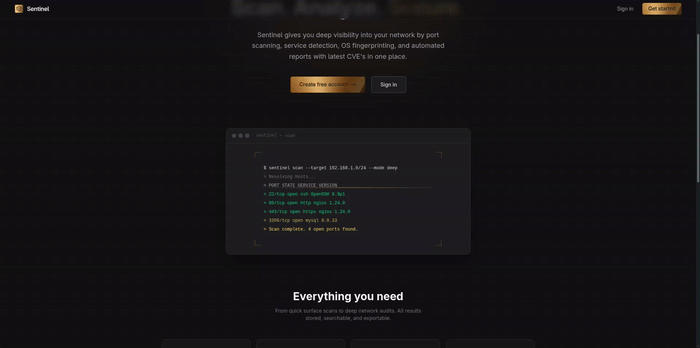

# 🛡️ Sentinel

> A modern security-focused web interface for distributed network vulnerability assessment.

Sentinel is a distributed vulnerability assessment platform designed to help security professionals and developers perform network reconnaissance, inspect discovered services, identify known vulnerabilities, and generate detailed security reports.

This repository contains the **Sentinel frontend** - a React-based web application that provides the user interface for authentication, scan management, results, vulnerability findings, and report generation.

The backend is maintained separately:

**Backend:** https://github.com/shaik-zayed/Sentinel

---

## ✨ Features

### 🔐 Authentication

- User registration
- Email verification
- Secure login flow
- Access and refresh token handling
- Automatic token refresh
- Logout
- Password reset
- Change password
- Protected application routes
- User profile

### 🔎 Network Scanning

Configure and submit network scans directly from the dashboard.

Supported scan configuration includes:

- Target host or network
- Scan mode
- Port configuration
- OS detection
- Service/version detection

Submitted scans are processed asynchronously by the Sentinel backend.

### 📊 Scan Management

- View previous scans
- Monitor scan status
- View individual scan results
- Paginated scan history
- Automatic status polling
- Delete scans

### 🐛 Vulnerability Intelligence

Sentinel's backend enriches discovered services with vulnerability information using the NVD/CVE ecosystem.

The frontend provides a structured interface for viewing the resulting security findings.

### 📄 Security Reports

Generate and download scan reports in multiple formats:

- PDF
- HTML
- DOCX

Reports are generated by the backend and delivered through the Sentinel API.

### 🎨 Modern Security-Focused UI

The interface uses a dark, security-oriented visual design with:

- Responsive layouts
- Reusable UI components
- Metallic/copper visual language
- Status indicators
- Loading states
- Error states
- Empty states
- Animated landing page
- Accessible form controls

---

## 🏗️ Architecture

Sentinel is split into a frontend and a distributed backend.

```text
                         ┌──────────────────────┐
                         │     Sentinel UI      │
                         │  React + TypeScript  │
                         └──────────┬───────────┘
                                    │
                                    │ REST / JSON
                                    ▼
                         ┌──────────────────────┐
                         │     API Gateway      │
                         │       :7777          │
                         └──────────┬───────────┘
                                    │
                 ┌──────────────────┼──────────────────┐
                 │                  │                  │
                 ▼                  ▼                  ▼
          ┌─────────────┐    ┌─────────────┐    ┌─────────────┐
          │    Auth     │    │    Scan     │    │   Report    │
          │   Service   │    │   Service   │    │   Service   │
          └─────────────┘    └──────┬──────┘    └─────────────┘
                                    │
                                    │ Kafka
                                    ▼
                            ┌─────────────┐
                            │ Nmap Service│
                            └──────┬──────┘
                                   │
                                   ▼
                          ┌─────────────────┐
                          │ Ephemeral Nmap  │
                          │ Docker Container│
                          └─────────────────┘

        Supporting infrastructure:

        ┌──────────┐   ┌──────────┐   ┌──────────┐
        │  MySQL   │   │  MinIO   │   │  Eureka  │
        └──────────┘   └──────────┘   └──────────┘
```

The frontend communicates with the backend through the API Gateway.

---

## 🧰 Tech Stack

### Frontend

| Technology | Purpose |
|---|---|
| React | UI framework |
| TypeScript | Type safety |
| Vite | Development & build tooling |
| React Router | Client-side routing |
| TanStack Query | Server state & API caching |
| Zustand | Client/auth state |
| Tailwind CSS | Styling |
| ESLint | Code quality |

### Backend

The backend is implemented as a Spring-based distributed microservices system.

| Technology | Purpose |
|---|---|
| Java | Backend services |
| Spring Boot | Microservices framework |
| Spring Cloud Gateway | API Gateway |
| Spring Security | Authentication & security |
| Apache Kafka | Asynchronous messaging |
| MySQL | Persistent data |
| Nmap | Network scanning |
| Docker | Scan isolation |
| MinIO | Report/object storage |
| Netflix Eureka | Service discovery |
| NVD API | CVE enrichment |

See the complete backend implementation:

**https://github.com/shaik-zayed/Sentinel**

---

## 📁 Project Structure

```text
src/
├── api/
│   ├── auth.ts
│   ├── client.ts
│   └── scans.ts
│
├── assets/
│
├── components/
│   ├── layout/
│   ├── ui/
│   ├── ErrorBoundary.tsx
│   └── ReportDownload.tsx
│
├── pages/
│   ├── auth/
│   │   ├── LoginPage.tsx
│   │   ├── RegisterPage.tsx
│   │   ├── VerifyEmailPage.tsx
│   │   ├── ForgotPasswordPage.tsx
│   │   ├── ResetPasswordPage.tsx
│   │   └── ChangePasswordPage.tsx
│   │
│   ├── scans/
│   │   ├── ScansPage.tsx
│   │   ├── NewScanPage.tsx
│   │   └── ScanDetailPage.tsx
│   │
│   ├── DashboardPage.tsx
│   ├── LandingPage.tsx
│   ├── ProfilePage.tsx
│   └── ReportsPage.tsx
│
├── store/
│   └── authStore.ts
│
├── styles/
│
├── utils/
│
├── App.tsx
├── config.ts
├── index.css
└── main.tsx
```

---

## 🚀 Getting Started

### Prerequisites

Make sure you have:

- Node.js 20+
- npm
- A running Sentinel backend

The frontend expects the Sentinel API Gateway to be available.

By default, the development configuration uses:

```text
http://localhost:7777
```

---

## 📦 Installation

Clone the repository:

```bash
git clone https://github.com/shaik-zayed/Sentinel_Frontend.git
cd Sentinel_Frontend
```

Install dependencies:

```bash
npm install
```

---

## ⚙️ Configuration

Create a local environment file:

```bash
cp .env.example .env
```

Configure the backend API URL:

```env
VITE_API_URL=http://localhost:7777
```

---

## 🖥️ Development

Start the development server:

```bash
npm run dev
```

Vite will provide a local development URL, typically:

```text
http://localhost:5173
```

---

## 🧹 Linting

Run ESLint:

```bash
npm run lint
```

---

## 🔗 Backend

The frontend requires the Sentinel backend to provide:

- Authentication
- User management
- Scan submission
- Scan status
- Scan results
- Vulnerability findings
- Report generation
- Report downloads

Backend repository:

**https://github.com/shaik-zayed/Sentinel**

The backend uses an API Gateway as the main entry point and Kafka to asynchronously process scan jobs.

---

## 🔄 Scan Workflow

A typical scan follows this flow:

```text
1. User logs in
       │
       ▼
2. Frontend receives authentication tokens
       │
       ▼
3. User configures a scan
       │
       ▼
4. Frontend submits scan to API Gateway
       │
       ▼
5. Scan Service creates scan job
       │
       ▼
6. Job is published to Kafka
       │
       ▼
7. Nmap Service consumes the job
       │
       ▼
8. Ephemeral Docker container runs Nmap
       │
       ▼
9. Results are published back through Kafka
       │
       ▼
10. Scan results are persisted
       │
       ▼
11. CVE enrichment is performed
       │
       ▼
12. Frontend displays results and findings
       │
       ▼
13. User generates/downloads a report
```

---

## 🔐 Security Considerations

Sentinel is designed as a security-focused application, but deployment security is still the responsibility of the operator.

Before deploying publicly:

- Use HTTPS/TLS
- Configure secure CORS policies
- Keep secrets outside source control
- Use strong JWT signing secrets
- Protect database credentials
- Restrict access to infrastructure services
- Secure Kafka and MinIO
- Keep Docker and Nmap execution isolated
- Configure appropriate network boundaries
- Apply rate limiting where appropriate
- Keep dependencies updated

### Responsible Scanning

Only scan systems and networks that you own or have explicit authorization to assess.

Unauthorized network scanning may violate organizational policies, terms of service, or applicable laws.

**Sentinel is intended for authorized security testing, vulnerability assessment, and defensive security research.**

---

## 🧪 Development Notes

The frontend is intentionally separated from the backend so that the UI and distributed scanning infrastructure can evolve independently.

The frontend is responsible for:

```text
Presentation
    ↓
User interaction
    ↓
API communication
    ↓
Authentication state
    ↓
Server state / caching
```

The backend is responsible for:

```text
Authentication
    ↓
Scan orchestration
    ↓
Asynchronous processing
    ↓
Nmap execution
    ↓
CVE enrichment
    ↓
Persistence
    ↓
Report generation
```

---

## 📸 Screenshots



- Landing page
- Login
- Dashboard
- New Scan
- Scan Results
- Vulnerability Findings
- Reports
- User Profile

---

## 🗺️ Roadmap

Potential future improvements:

- [ ] Advanced vulnerability filtering
- [ ] CVSS-based severity dashboards
- [ ] Scan comparison
- [ ] Scheduled scans
- [ ] Recurring vulnerability monitoring
- [ ] Exportable vulnerability summaries
- [ ] Role-based access control
- [ ] Team/workspace support
- [ ] Improved audit logging
- [ ] CI/CD security scanning
- [ ] Production deployment documentation
- [ ] Automated frontend tests
- [ ] End-to-end testing

---

## 👨‍💻 Author

**Shaik Zayed**

GitHub: https://github.com/shaik-zayed

---

## ⭐ Sentinel

Sentinel brings together modern web application architecture, distributed systems, network reconnaissance, vulnerability intelligence, and security reporting into a single platform.

If you find the project useful, consider giving it a ⭐ on GitHub.

**Frontend:** Sentinel Web UI. (_In development phase not a finished product_)  
**Backend:** https://github.com/shaik-zayed/Sentinel

---
Made with 💔 and tokens.